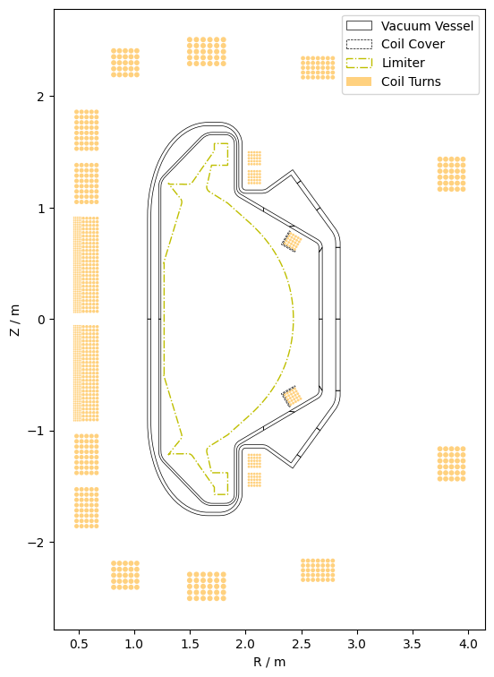

# Open Source SPARC Device Description

The Open Source version of the SPARC Device Description is meant as an example
of an IMAS data schema based geometry description which can be used as input
for example workflows of fusion simulation & analysis tools.

> [!IMPORTANT]
> **This is not an accurate description of the geometry of SPARC.**
>
> The shared data is based upon SPARC but various details are removed or
> changed to avoid sharing details which are protected by CFS' intellectual
> property. For example, while the coil locations are based on SPARC, the
> division of those coils into turns, is replaced by toy data.


# What's included in the Device Description?

Because a picture speaks a thousand words, let's start with one:



Shown on the plot are:

- Outlines of various structural sections that make up the inner and outer vacuum vessel.
- The contour of the limiter
- Coil turns of various coils
- Shielding covers for the vertical stability coils


Workflows & tools which require a meshed representation benefit from having the
vacuum vessel represented by the shown closed outlines of sections which can be
meshed. However, sometimes people or tools prefer to have access to an annular
description, which is why we also provide an annular description of the vacuum
vessel.


# How do I use the Device Description?

The device description itself is stored in the `json` file
[`OS_SPARC_Device_Description.json`](./OS_SPARC_Device_Description.json) in
this folder. This file was created using the
[OMAS](https://gafusion.github.io/omas/index.html) python library, which
ensures that the data adheres to the IMAS data schema.

While one could simply read this file like any other `json` file, we suggest
you use the `OMAS` library as it simplifies the interaction with the deeply nested
hierarchical structure of the IMAS data schema.

To demonstrate this usage, we've created a simple example which shows how to
access the device description to create the above plot.


First let's setup a small python development environment. To keep the example
minimal and minimize dependencies we will simply use the `venv` module. But
feel free to use your tool of choice for managing python virtual environments!

To create a virtual environment, run the following command from within this folder:
```
python3 -m venv .venv
```
and then activate it by running:
```
source ./.venv/bin/activate
```

Now we are ready to install the few dependencies we require (`OMAS` & `Matplotlib`), by using the following command:
```
pip install -r requirements.txt
```

And now running the example:
```
python3 plot.py -f OS_SPARC_Device_Description.json
```

should bring up a new Matplotlib window showing the same plot that we see
above.

The python script [`plot.py`](./plot.py) includes various comments to explain
how the device description is accessed.

More details on the IMAS data schema can be found on [this OMAS
webiste](https://gafusion.github.io/omas/schema.html), and for more examples of
how to use the `OMAS` library we suggest you follow [their
examples](https://gafusion.github.io/omas/auto_examples/index.html).
